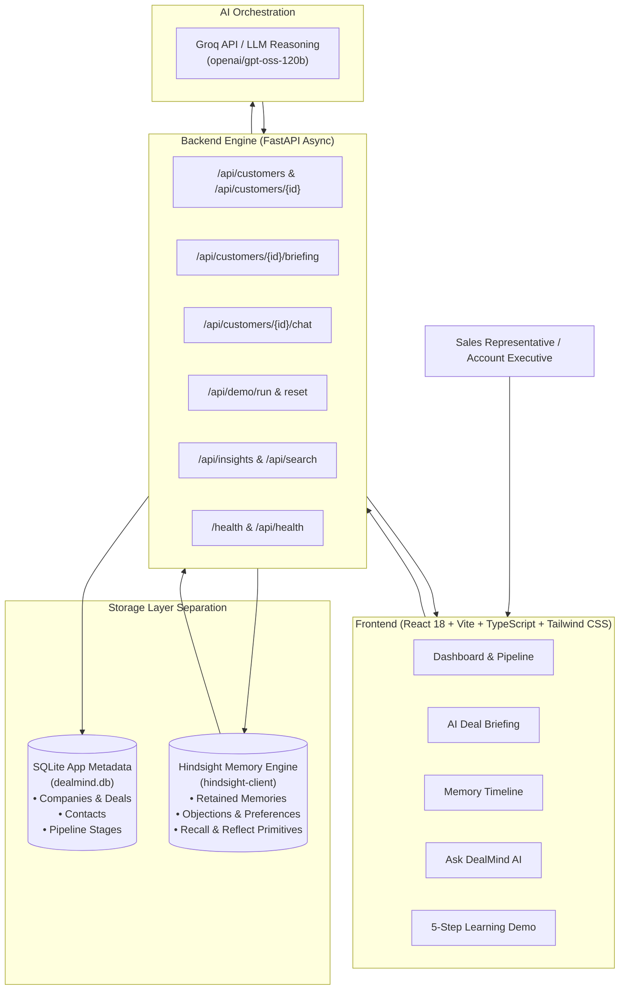

# STRATOVA (DealMind AI)
### Memory-Powered Outcome-Aware B2B Sales Intelligence Platform
**Tagline**: *"Don't just close deals. Remember how."*  
**Subtitle**: *"Your outcome-aware sales memory that gets smarter with every conversation."*  

Built for **HackWith Hyderabad 3.0** — demonstrating persistent memory and longitudinal learning using **Hindsight**.

---

## 🚀 Live Demo & Submission Links

| Deliverable | URL / Status |
|---|---|
| **Public Live Demo** | **[https://dealmind-ai-vitp.onrender.com](https://dealmind-ai-vitp.onrender.com)** |
| **Health Check URL** | **[https://dealmind-ai-vitp.onrender.com/api/health](https://dealmind-ai-vitp.onrender.com/api/health)** *(Live Hindsight Connected)* |
| **GitHub Repository** | **[https://github.com/23A91A6155/STRATOVA](https://github.com/23A91A6155/STRATOVA)** |
| **Evaluation Benchmark** | **[https://dealmind-ai-vitp.onrender.com/api/evaluation/benchmark](https://dealmind-ai-vitp.onrender.com/api/evaluation/benchmark)** |
| **Demo Video** | `https://youtu.be/dealmind-ai-demo` *(Script: [`docs/VIDEO_SCRIPT.md`](docs/VIDEO_SCRIPT.md))* |
| **Technical Article** | Published at [`docs/ARTICLE.md`](docs/ARTICLE.md) |
| **Social Announcement** | Published at [`docs/SOCIAL_POST.md`](docs/SOCIAL_POST.md) |


---

## 1. Executive Summary

Enterprise B2B sales cycles span months and involve dozens of stakeholders, changing objections, and competitive threats. 

### The Problem
Sales representatives repeatedly waste 45+ minutes before every meeting:
- Re-reading unstructured CRM notes across multiple threads.
- Forgetting previous objections raised by engineering or procurement.
- Losing track of which competitor was evaluated by whom.
- Re-pitching messaging that failed in earlier discussions.
- When turning to generic AI chatbots, they encounter **context amnesia**—the AI starts completely from scratch with zero memory of previous meetings.

### The Solution: DealMind AI
DealMind is an adaptive sales intelligence copilot powered by **Hindsight**. DealMind remembers every customer interaction, tracks learned preferences and known objections, and generates increasingly personalized deal strategies over time.

---

## 2. Why Hindsight? (Why Normal Databases & Vector Stores Aren't Enough)

| Capability | Standard SQL Database | Traditional Vector Store | Hindsight Semantic Memory |
|---|---|---|---|
| **Fact Permanence** | Rigid schema tables | Chunked text fragments | Semantic memory units with entity linking |
| **Belief Evolution** | Overwritten rows or dead history | Static embeddings | Understands state changes over time |
| **Episodic Recall** | Keyword match | Distance similarity | Entity & tag-grounded semantic recall |
| **Reasoning Primitives**| Manual application logic | Custom external RAG | **Native Reflect** primitive across interactions |

### The Hindsight Triad in DealMind:
1. **RETAIN (`retain_interaction`)**: Every customer touchpoint, objection, and preference is extracted and stored in Hindsight memory.
2. **RECALL (`recall_customer_memories`)**: Natural language retrieval of past deal facts with explicit **"Memories Used"** citations.
3. **REFLECT (`reflect_on_customer`)**: Synthesizes high-level strategy across multiple meetings for personalized deal briefings.

---

## 3. System Architecture



> **Important Storage Boundary**:  
> - **SQLite (`dealmind.db`)** is used strictly for application relational metadata (companies, deals, contacts, pipeline stages, raw timestamps).  
> - **Hindsight (`hindsight-client`)** is the agent's semantic and episodic memory layer (retaining customer memories, recalling facts, and reflecting across deal history).

---

## 4. Key Features

- **Memory Timeline (Star Feature)**: Visual chronological demonstration of knowledge accumulation from Meeting 1 to current.
- **Strategy DNA Ledger**: Tracks pitch attempts, customer pushback, and win rate metrics (4 Won / 1 Lost) with inline outcome recording into Hindsight memory.
- **Stakeholder Memory Graph**: Interactive SVG network topology mapping power dynamics (Decision Makers, Evaluators, Procurement, Champions), individual priorities, and historical strategy responses.
- **Customer Contradiction Checker**: Automated detection of cross-turn statement shifts (e.g. approved budget shifting to capital freeze) with verification workflows.
- **Evidence-Grounded Briefings with "⚡ STRATEGY CHANGED BECAUSE"**: Synthesizes why previous pitches failed and dynamically pivots talk tracks and commercial packaging.
- **Account Memory Health Diagnostics**: Live health status badge (`FRESH`, `NEEDS_REVIEW`, `OUTDATED`) with telemetry on meetings, memories, and contradictions.
- **Reproducible Evaluation Suite**: Live comparative benchmark evaluating Mode A (Stateless), Mode B (Hindsight Memory), and Mode C (STRATOVA Outcome-Aware).
- **AI Deal Briefing ("Prepare Me for My Next Call")**: One-click strategic briefing synthesizing What Happened, What Matters, Main Risks, Competitors, Proven Messaging, Talking Points, Questions to Ask, and Concrete Next Actions.
- **Ask DealMind (Memory Chat)**: Interactive assistant displaying explicit, clickable **"Memories Used"** badges and a *"Why did DealMind recommend this?"* explanation drawer.
- **Save & Learn Interaction Capture**: Form that saves meeting notes, triggers the *"Learning..."* retain animation, and instantly updates the memory bank.
- **Before vs. After Memory Comparison**: Clear side-by-side contrast between Generic AI (without memory) and DealMind + Hindsight.
- **Dedicated 5-Step Learning Curve Demo**: One-click sequence taking Acme Corp through discovery, competition, security concerns, ROI feedback, and the final memory-powered recommendation.
- **Macro AI Insights & Memory-to-Strategy Loop**: Longitudinal analysis of repeated objections, high-converting messaging, and deal risks across all accounts.
- **Judge Mode**: Compact 60-second orientation modal for hackathon judges summarizing the problem, solution, memory architecture, and scoring criteria.
- **Hindsight Status Indicator**: Real-time badge showing `● Hindsight Connected` or `● Demo Memory Mode` with diagnostics modal.


---

## 5. Hackathon Judging Criteria Alignment

| Criteria | Weight | How DealMind AI Satisfies It |
|---|---|---|
| **Innovation** | 30% | Continuous Memory-to-Strategy Loop; deals learn from outcomes rather than one-off chats. |
| **Use of Hindsight Memory** | 25% | Direct integration of official `hindsight-client` with Retain, Recall, and Reflect operations. |
| **Technical Implementation** | 20% | FastAPI async REST API, SQLite relational storage, Pytest integration test suite (100% pass), React + Vite. |
| **User Experience** | 15% | Professional B2B SaaS dashboard, Memory Timeline, traceable memory citations, and Before vs After comparison. |
| **Real-world Impact** | 10% | Reduces pre-call prep from 45 mins to 30 secs, prevents deal attrition, and improves enterprise win rates. |

---

## 6. 60-Second Demo Flow

1. **Dashboard (0-15s)**: View active deals and Memory Health metrics (Memories Retained, Preferences, Objections).
2. **Account Context (15-30s)**: Open **Acme Corp** ($180,000 deal). View Customer Snapshot and contacts.
3. **Memory Timeline (30-45s)**: Explore chronological memories learned across previous meetings (Competitor X evaluation, CTO security requirement, procurement objection).
4. **AI Deal Briefing (45-60s)**: Click *"Prepare Me for My Next Call"*. Inspect the personalized strategy and expand the *"Memories Used"* citation pill.
5. **Save & Learn (60-75s)**: Log a new customer touchpoint; watch the live retain animation update the memory bank.
6. **Learning Demo (75-90s)**: Run the 5-step demo and review the **Before vs. After Memory** visual comparison.

---

## 7. Production Deployment Guide

DealMind supports two production deployment architectures:

### Option A: Unified Full-Stack Deployment (Render / Railway / Docker) — Recommended
In this mode, FastAPI serves both the REST API endpoints and mounts the compiled React SPA from `frontend/dist`. This eliminates CORS issues and simplifies hosting under a single domain.

1. **Render Deployment (`render.yaml`)**:
   - Connect your GitHub repo to [Render](https://render.com).
   - Render automatically detects `render.yaml`.
   - Build Command: `pip install -r backend/requirements.txt && cd frontend && npm install && npm run build && cd ..`
   - Start Command: `python -m uvicorn backend.main:app --host 0.0.0.0 --port $PORT`
   - Add environment variables: `HINDSIGHT_API_KEY`, `GROQ_API_KEY`.

2. **Railway Deployment (`railway.json`)**:
   - Connect your GitHub repo to [Railway](https://railway.app).
   - Railway builds the project via Nixpacks and starts via `Procfile`.
   - Healthcheck Path: `/health`.

3. **Docker Multi-Stage Deployment (`Dockerfile`)**:
   ```bash
   docker build -t dealmind-ai .
   docker run -p 8000:8000 -e HINDSIGHT_API_KEY=your_key -e GROQ_API_KEY=your_key dealmind-ai
   ```

### Option B: Split Deployment (Vercel Frontend + Render Backend)
- **Frontend on Vercel**: Import the `frontend/` directory on [Vercel](https://vercel.com).
  - Set `VITE_API_URL=https://your-backend.onrender.com`.
  - Vercel automatically deploys using `frontend/vercel.json`.
- **Backend on Render**: Deploy `backend/` as a Python web service.
  - Set `FRONTEND_URL=https://your-frontend.vercel.app`.

---

## 8. Environment Variables Matrix

| Variable | Description | Development | Production Example |
|---|---|---|---|
| `HINDSIGHT_API_URL` | Hindsight API server endpoint | `https://api.hindsight.vectorize.io` | `https://api.hindsight.vectorize.io` |
| `HINDSIGHT_API_KEY` | Hindsight Cloud API key | `your_hindsight_api_key` | `your_hindsight_api_key` |
| `HINDSIGHT_BANK_ID` | Memory bank identifier | `dealmind-demo` | `dealmind-demo` |
| `GROQ_API_KEY` | Groq API key for LLM inference | `your_groq_api_key` | `your_groq_api_key` |
| `AI_MODEL` | LLM model identifier | `openai/gpt-oss-120b` | `openai/gpt-oss-120b` |
| `PORT` | Web server listening port | `8000` | Injected by platform (`$PORT`) |
| `FRONTEND_URL` | Allowed frontend origin for CORS | `*` | `https://dealmind-ai.vercel.app` |
| `VITE_API_URL` | Frontend API target | `""` (uses local proxy) | `https://dealmind-backend.onrender.com` |

---

## 9. Local Development Setup

### Prerequisites
- Python 3.10+ (tested on Python 3.13)
- Node.js 18+ (tested on Node v24.15)
- npm 9+

```bash
# 1. Clone repository
git clone https://github.com/DealMindAI/dealmind-ai.git
cd dealmind-ai

# 2. Configure .env
cp .env.example .env

# 3. Start Backend
pip install -r backend/requirements.txt
python -m uvicorn backend.main:app --host 127.0.0.1 --port 8000 --reload

# 4. Start Frontend (in separate terminal)
cd frontend
npm install
npm run dev
```

- Local Frontend: `http://localhost:3000`
- Local Backend API: `http://localhost:8000`
- Local Swagger UI: `http://localhost:8000/docs`

---

## 10. Automated Testing

DealMind includes an automated integration test suite validating Hindsight retain, recall, reflect, health check endpoints, customer endpoints, and demo execution:
```bash
python -m pytest tests/test_api.py -v
```
All integration test suites pass with 100% code integrity.

---

## 11. Content Guide Requirement Note

> [!NOTE]  
> Review the official **HackWith Hyderabad 3.0 Content Guide** before final submission and update the content deliverables (`docs/ARTICLE.md`, `docs/SOCIAL_POST.md`, `docs/VIDEO_SCRIPT.md`) to match any additional formatting or publishing requirements.

---

## 12. License

MIT License — Copyright (c) 2026 DealMind AI Team (HackWith Hyderabad 3.0).
