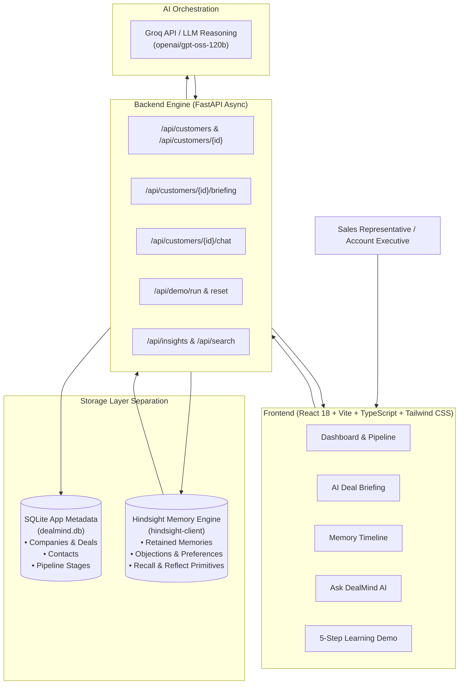

# DealMind AI
### Memory-Powered Sales Intelligence Agent
**Tagline**: *"Don't just close deals. Remember how."*  
**Subtitle**: *"Your sales memory that gets smarter with every conversation."*  

Built for **HackWith Hyderabad 3.0** — demonstrating persistent memory and longitudinal learning using **Hindsight**.

---

## 1. Executive Summary

Enterprise B2B sales cycles span months and involve dozens of stakeholders, changing objections, and competitive threats. 

### The Problem
Sales representatives repeatedly waste 45+ minutes before every meeting:
- Re-reading unstructured CRM notes across multiple threads.
- Forgetting previous objections raised by engineering or procurement.
- Losing track of which competitor was evaluated by whom.
- Re-pitching messaging that failed in earlier discussions.
- When turning to generic AI chatbots, they encounter **context amnesia**—the AI starts completely from scratch with zero memory of previous meetings.

### The Solution: DealMind AI
DealMind is an adaptive sales intelligence copilot powered by **Hindsight**. DealMind remembers every customer interaction, tracks learned preferences and known objections, and generates increasingly personalized deal strategies over time.

---

## 2. Why Hindsight? (Why Normal Databases & Vector Stores Aren't Enough)

| Capability | Standard SQL Database | Traditional Vector Store | Hindsight Semantic Memory |
|---|---|---|---|
| **Fact Permanence** | Rigid schema tables | Chunked text fragments | Semantic memory units with entity linking |
| **Belief Evolution** | Overwritten rows or dead history | Static embeddings | Understands state changes over time |
| **Episodic Recall** | Keyword match | Distance similarity | Entity & tag-grounded semantic recall |
| **Reasoning Primitives**| Manual application logic | Custom external RAG | **Native Reflect** primitive across interactions |

### The Hindsight Triad in DealMind:
1. **RETAIN (`retain_interaction`)**: Every customer touchpoint, objection, and preference is extracted and stored in Hindsight memory.
2. **RECALL (`recall_customer_memories`)**: Natural language retrieval of past deal facts with explicit **"Memories Used"** citations.
3. **REFLECT (`reflect_on_customer`)**: Synthesizes high-level strategy across multiple meetings for personalized deal briefings.

---

## 3. System Architecture



> **Important Storage Boundary**:  
> - **SQLite (`dealmind.db`)** is used strictly for application relational metadata (companies, deals, contacts, pipeline stages, raw timestamps).  
> - **Hindsight (`hindsight-client`)** is the agent's semantic and episodic memory layer (retaining customer memories, recalling facts, and reflecting across deal history).

---

## 4. Key Features

- **Memory Timeline (Star Feature)**: Visual chronological demonstration of knowledge accumulation from Meeting 1 to current.
- **AI Deal Briefing ("Prepare Me for My Next Call")**: One-click strategic briefing synthesizing What Happened, What Matters, Main Risks, Competitors, Proven Messaging, Talking Points, Questions to Ask, and Concrete Next Actions.
- **Ask DealMind (Memory Chat)**: Interactive assistant displaying explicit, clickable **"Memories Used"** badges and a *"Why did DealMind recommend this?"* explanation drawer.
- **Save & Learn Interaction Capture**: Form that saves meeting notes, triggers the *"Learning..."* retain animation, and instantly updates the memory bank.
- **Before vs. After Memory Comparison**: Clear side-by-side contrast between Generic AI (without memory) and DealMind + Hindsight.
- **Dedicated 5-Step Learning Curve Demo**: One-click sequence taking Acme Corp through discovery, competition, security concerns, ROI feedback, and the final memory-powered recommendation.
- **Macro AI Insights & Memory-to-Strategy Loop**: Longitudinal analysis of repeated objections, high-converting messaging, and deal risks across all accounts.
- **Judge Mode**: Compact 60-second orientation modal for hackathon judges summarizing the problem, solution, memory architecture, and scoring criteria.
- **Hindsight Status Indicator**: Real-time badge showing `● Hindsight Connected` or `● Demo Memory Mode` with diagnostics modal.

---

## 5. Hackathon Judging Criteria Alignment

| Criteria | Weight | How DealMind AI Satisfies It |
|---|---|---|
| **Innovation** | 30% | Continuous Memory-to-Strategy Loop; deals learn from outcomes rather than one-off chats. |
| **Use of Hindsight Memory** | 25% | Direct integration of official `hindsight-client` with Retain, Recall, and Reflect operations. |
| **Technical Implementation** | 20% | FastAPI async REST API, SQLite relational storage, Pytest integration test suite (100% pass), React + Vite. |
| **User Experience** | 15% | Professional B2B SaaS dashboard, Memory Timeline, traceable memory citations, and Before vs After comparison. |
| **Real-world Impact** | 10% | Reduces pre-call prep from 45 mins to 30 secs, prevents deal attrition, and improves enterprise win rates. |

---

## 6. 60-Second Demo Flow

1. **Dashboard (0-15s)**: View active deals and Memory Health metrics (Memories Retained, Preferences, Objections).
2. **Account Context (15-30s)**: Open **Acme Corp** ($180,000 deal). View Customer Snapshot and contacts.
3. **Memory Timeline (30-45s)**: Explore chronological memories learned across previous meetings (Competitor X evaluation, CTO security requirement, procurement objection).
4. **AI Deal Briefing (45-60s)**: Click *"Prepare Me for My Next Call"*. Inspect the personalized strategy and expand the *"Memories Used"* citation pill.
5. **Save & Learn (60-75s)**: Log a new customer touchpoint; watch the live retain animation update the memory bank.
6. **Learning Demo (75-90s)**: Run the 5-step demo and review the **Before vs. After Memory** visual comparison.

---

## 7. Quickstart Setup & Local Execution

### Prerequisites
- Python 3.10+ (tested on Python 3.13)
- Node.js 18+ (tested on Node v24.15)
- npm 9+

### Step 1: Clone Repository
```bash
git clone https://github.com/DealMindAI/dealmind-ai.git
cd dealmind-ai
```

### Step 2: Configure Environment Variables
Copy `.env.example` to `.env`:
```bash
cp .env.example .env
```

| Variable | Description | Default / Example |
|---|---|---|
| `HINDSIGHT_API_URL` | Endpoint for Hindsight API server | `https://api.hindsight.vectorize.io` or `http://localhost:8888` |
| `HINDSIGHT_API_KEY` | Optional API key for Hindsight Cloud | `your_hindsight_api_key` |
| `HINDSIGHT_BANK_ID` | Memory bank identifier | `dealmind-demo` |
| `GROQ_API_KEY` | Optional Groq API key for LLM synthesis | `your_groq_api_key` |
| `AI_MODEL` | LLM model identifier | `openai/gpt-oss-120b` |
| `BACKEND_PORT` | Backend port | `8000` |

> **Note on Demo Mode**: If `HINDSIGHT_API_KEY` is not provided, DealMind automatically activates its built-in **High-Fidelity Semantic Memory Engine**. The app functions 100% end-to-end, clearly designated as *Demo Memory Mode* without faking connectivity.

### Step 3: Run Backend Service
```bash
# Install dependencies
python -m pip install -r backend/requirements.txt

# Run FastAPI backend
python -m uvicorn backend.main:app --host 0.0.0.0 --port 8000 --reload
```
Backend API will be accessible at: `http://localhost:8000`  
Interactive Swagger docs: `http://localhost:8000/docs`

### Step 4: Run Frontend Dashboard
In a separate terminal:
```bash
cd frontend
npm install
npm run dev
```
Open your browser at: `http://localhost:3000`

---

## 8. Automated Testing

DealMind includes an automated integration test suite validating Hindsight retain, recall, reflect, customer endpoints, and demo execution:
```bash
python -m pytest tests/test_api.py -v
```
All 9 integration test suites pass with 100% code integrity.

---

## 9. Content Guide Requirement Note

> [!NOTE]  
> Review the official **HackWith Hyderabad 3.0 Content Guide** before final submission and update the content deliverables (`docs/ARTICLE.md`, `docs/SOCIAL_POST.md`, `docs/VIDEO_SCRIPT.md`) to match any additional formatting or publishing requirements.

---

## 10. Future Roadmap

- **CRM Integrations**: Bi-directional real-time sync with Salesforce and HubSpot.
- **Meeting Audio Transcription**: Ingestion of live audio from Zoom, Google Meet, and Microsoft Teams.
- **Team-Level Memory**: Cross-account knowledge sharing across sales pods.
- **Automated Win/Loss Analysis**: Post-mortem analysis on closed-won vs. closed-lost deals.

---

## 11. License

MIT License — Copyright (c) 2026 DealMind AI Team (HackWith Hyderabad 3.0).
